GCP 환경 구성
==================
목차

- [1. VM 생성](#1-vm-생성)
- [2. 외부 IP 설정](#2-외부-ip-설정)
- [3. 방화벽 설정](#3-방화벽-설정)
- [4. Terminal 접근](#4-terminal-접근)
    - [4.1. 키 생성](#41-키-생성)
    - [4.2. 키 등록](#42-키-등록)
    - [4.3. MobaXterm 접근](#43-mobaxterm-접근)
    - [4.4. FileZilla](#44-filezilla)

# 1. VM 생성

Google Cloud Platform(GCP)에서 VM 인스턴스 생성을 위하여 다음과 같이 작업한다.

- Compute Engine -> VM 인스턴스
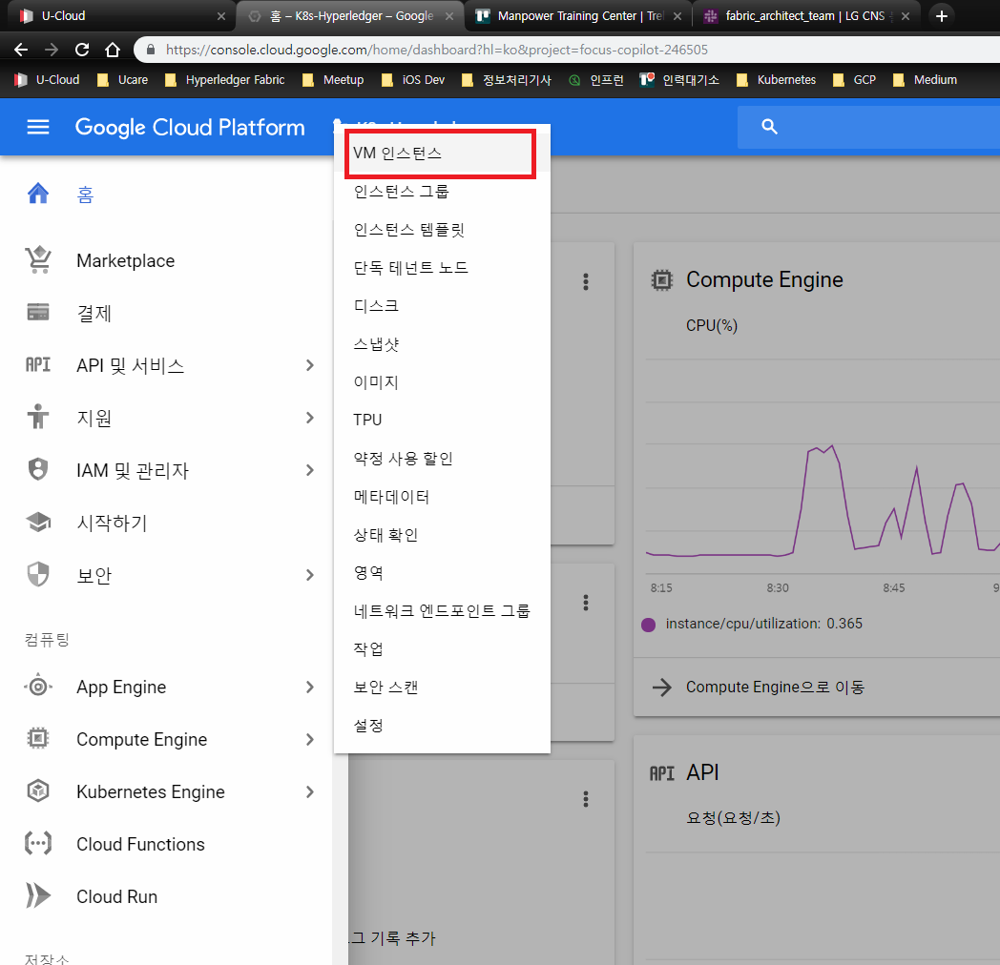

VM 인스턴스 창에 접근한 이후 인스턴스 만들기를 클릭하고 이름과 리전등을 선택한다.
이때 리전별로 VM의 가격이 차이가 나기 때문에 최대한 가격이 저렴한 곳에서 하는 것을
추천한다.

- [GCP 리전별 Ping 확인](http://www.gcping.com)
    - 가격이 가장 저렴한 곳 중 ping이 가장 잘 나오는 곳으로 선택하는 것을 추천

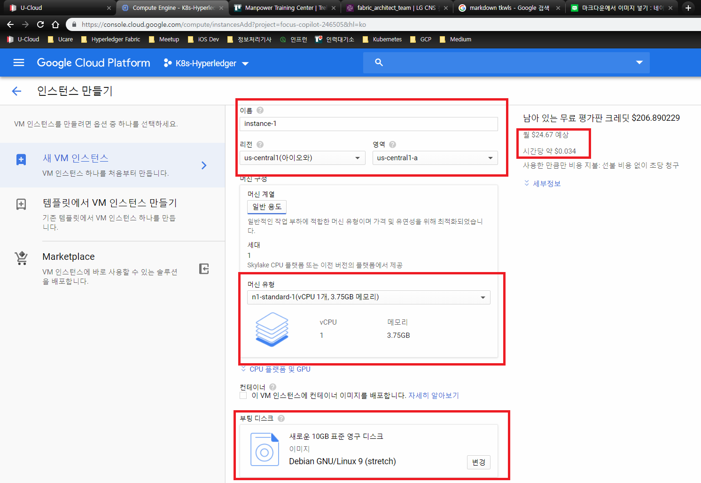

- 머신유형
    - 커스텀을 선택할 경우 동일한 성능임에도 가격이 비싸질 수 있기 때문에 표준형을 추천
    - 추후 변경이 가능하므로 1core/3.75GB로 VM 생성

- 부팅디스크
    - OS를 고를수 있으면 우분투의 다양한 버전이 존재
    - 하단의 사진에서 부팅디스크 유형을 2종류로 선택할 수 있으며, 표준영구디스크(HDD)
    를 사용할 경우 저렴하게 이용할 수 있다. 
    
    - 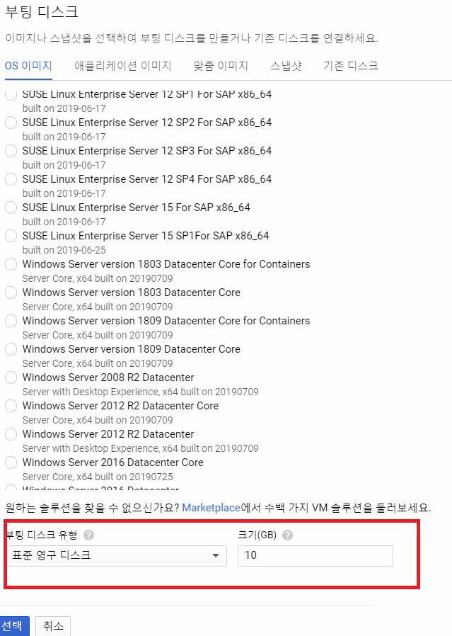

ID 및 방화벽 설정

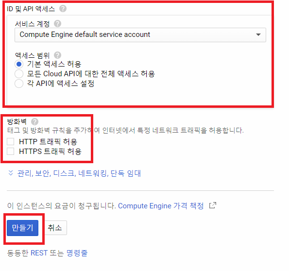

- ID 및 접근권한
    - 추후 설정이 가능하며, default값으로 설정

- 방화벽
    - 추후 설정이 가능하고, HTTP 트래픽 허용을 클릭할 경우 80포트가 방화벽 룰에 추가
    - 자유롭게 설정
   
만들기 버튼을 누르면 다음과 같이 화면에 VM이 생성된다.
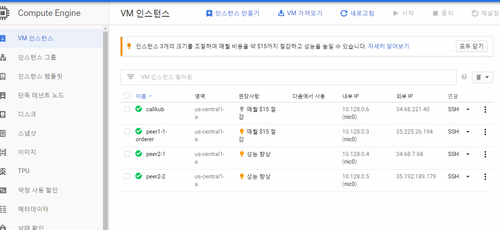

# 2. 외부 IP 설정

외부 IP 설정을 위하여 상단 검색창에 외부 IP 주소를 입력하고 접근한다.

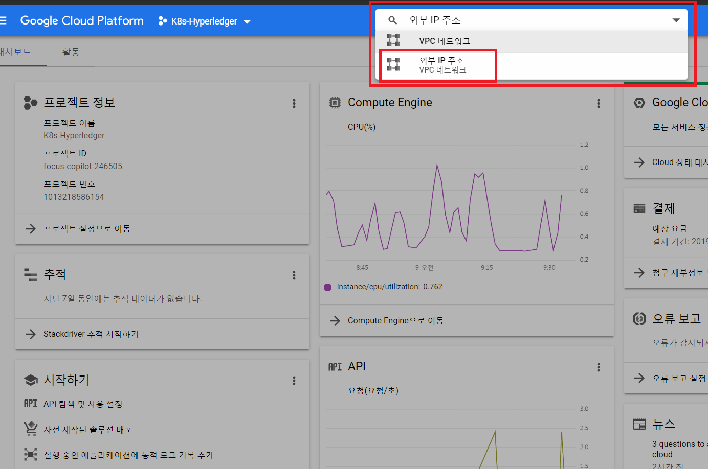

새로 생성한 VM은 임시 IP 주소로 할당되어 있으며, VM을 종료하고 재부팅시 IP 주소가
변경되기 때문에 고정 IP를 신청하는 것을 추천한다.
다음과 같이 고정 버튼을 클릭하면 고정 IP가 생성되며 외부 주소 IP로 접근이 가능하다.

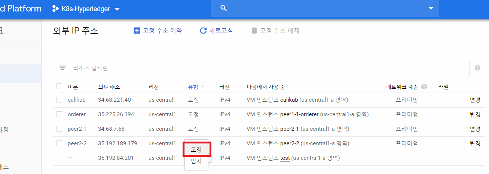

# 3. 방화벽 설정

각 VM 혹은 전체 VM에 대한 방화벽 룰을 설정하기 위해 다음 사진과 같이 방화벽 규칙에
접근한다.
- default setting
    - ssh를 위한 22번 포트는 default로 open 설정임

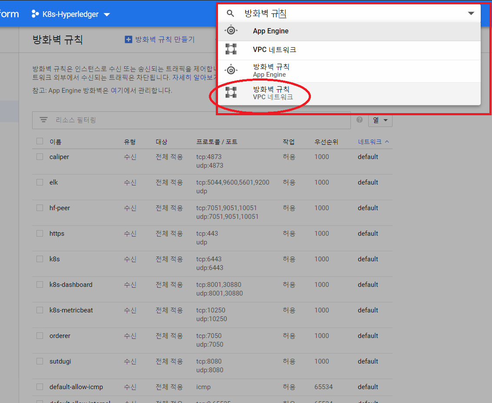

상단의 방화벽 규칙 만들기를 클릭하면, 다음과 같은 창이 나온다.

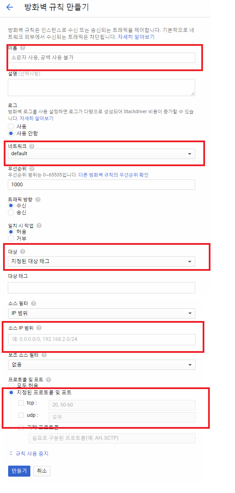

- 대상
    - 모든 VM에 대하여 공통된 방화벽 설정을 하고 싶은 경우, 네트워크의 모든 인스턴스를
    선택

- 프로토콜 및 포트
    - tcp/udp 를 선택한 이후 원하는 포트를 입력(복수개의 포트 및 범위 선택 가능)

만들기 버튼을 클릭하면 방화벽 규칙이 생성된다.

# 4. Terminal 접근

GCP 자체적으로 CLI 환경등을 제공하고 있지만, 여러 제약 상황이 존재한다.
따라서 MobaXterm과 같은 툴을 사용하여 CLI 환경에 접근하고 싶은 경우 혹은 FileZilla와 같은 툴을 사용하고 싶은 경우 공개키/비밀키 쌍을 생성해야한다.

## 4.1. 키 생성

- [Putty 다운로드](https://www.chiark.greenend.org.uk/~sgtatham/putty/latest.html)

1. 위의 링크에서 putty를 다운받고 `puttygen.exe` 파일을 실행
1. Generate 버튼을 클릭
1. Key comment 항목에 host 이름을 입력
    - host이름은 자유롭게 생성 가능
1. passphrase는 필수값은 아니지만 원하는 경우 입력
1. `
ssh-rsa AAAAB3NzaC1yc2EAAAABJQAAAIEAw5eEj1yJqHpp0hJwLo9s1oNLEO3R/ahMp/F9NkaTj63VJUJABT/KyH+T8VN5mE15+tMJgFIfYimGKBfxlBuv9R+udWx+0XbkZflLOBqI3ABZAk7MLL1R28Y8zlkUsLs09DBdzpWMNS1Uchn2GS1ksTEmN5eymI+kpzeHHaIUJnE= host
`
    - 메모장에 위의 형식과 같은 public key 값을 복사
1. save private key 버튼을 클릭하여 비밀키 저장

## 4.2. 키 등록

1. GCP 검색창에 메타데이터 검색 후 클릭
    - 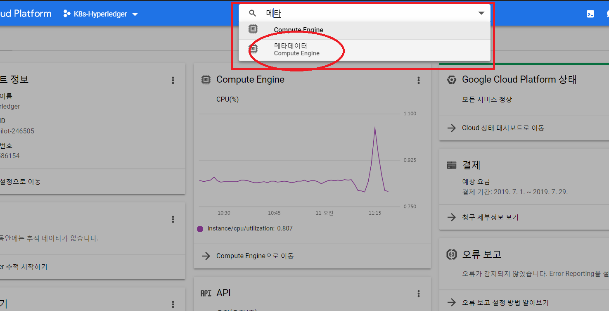
1. SSH 키 항목 접근 후 수정 버튼 클릭
1. 항목 추가 버튼을 클릭한 뒤 메모장에 복사한 public key를 붙여넣기 한 후 저장
    - 모든 node에 대하여 같은 키로 접근이 가능함

## 4.3. MobaXterm 접근

1. Session -> SSH
    - 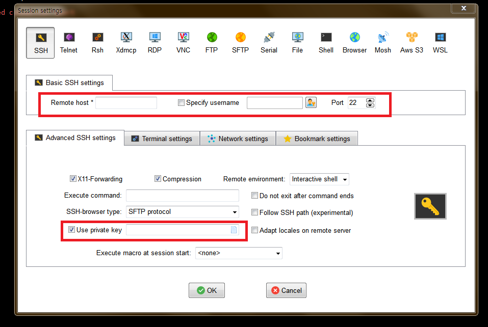
1. host IP 입력
    - GCP의 고정 IP 주소
1. Specify username
    - 키 생성시 Key comment 항목에 입력한 host 이름을 입력

1. Use private key 박스를 활성화 한 뒤, 저장한 private key file 경로를 입력
1. OK 버튼을 누르면 GCP VM 접근 가능
---

## 4.4. FileZilla

1. 파일질라 실행
    - 상단의 파일 -> 사이트 관리자

1. 정보 입력
    - 호스트: 고정 IP
    - 포트: 22
    - 로그온 유형: 키 파일
    - 사용자: 키 생성시 Key comment 항목에 입력한 host 이름
    - 키파일: private key 저장 경로
    - 참고
        - 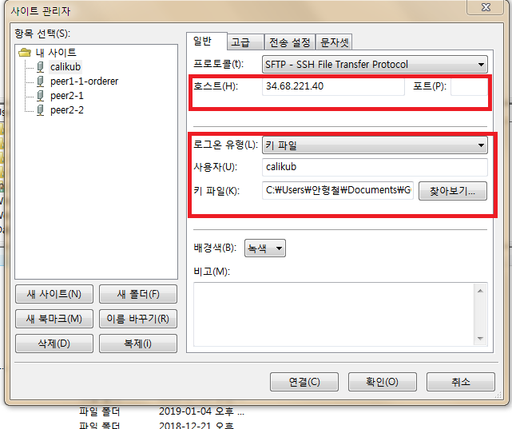

1. 연결 버튼 클릭